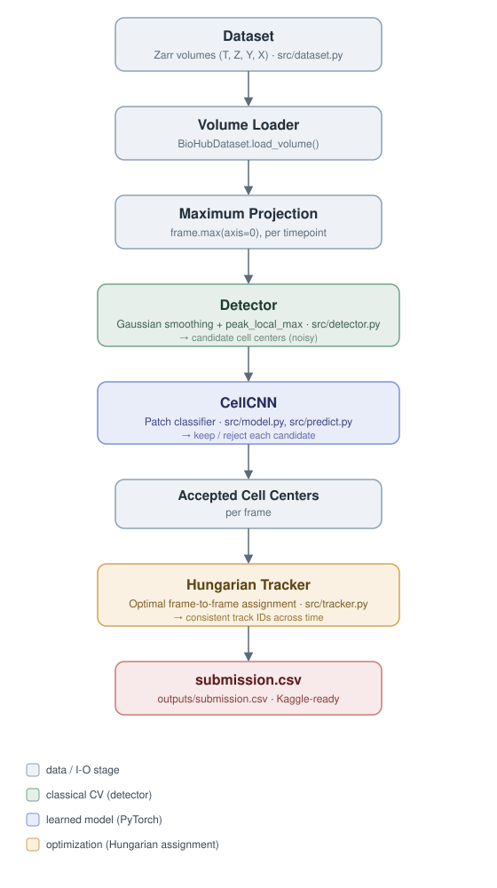
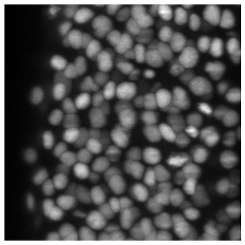
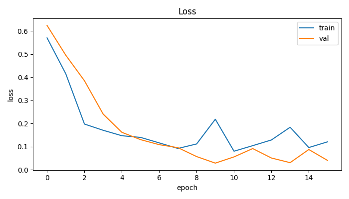
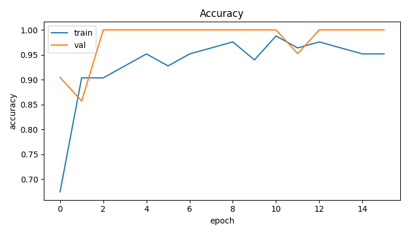
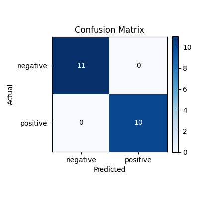
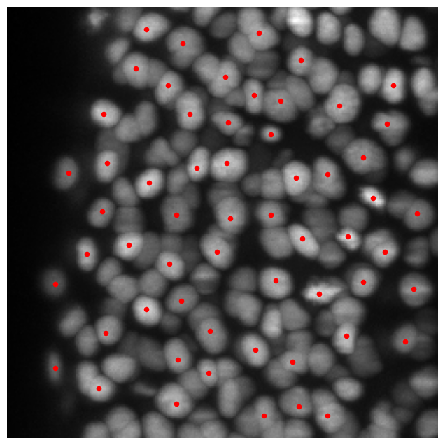
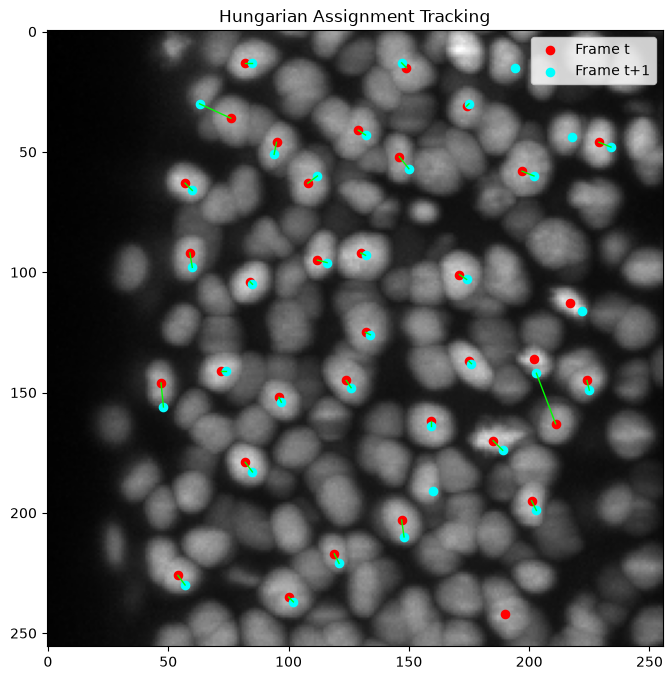

# LabOS

An AI-powered research workspace for live-cell imaging: 3D cell detection, classification,
tracking, and division detection in developing zebrafish embryo microscopy — analyze an
experiment start to finish and get a scientific report out the other end.

The underlying pipeline (`src/`) originated as a solution for the Kaggle
[BioHub - Cell Tracking During Development](https://www.kaggle.com/competitions/biohub-cell-tracking-during-development)
competition — that competition-specific work still lives in `notebooks/` and `kaggle/` and is
explicitly labeled as such throughout; everywhere else in this repository, "LabOS" is the
product this pipeline now powers. See [`docs/PHASE4_PITCH.md`](docs/PHASE4_PITCH.md) for why
that distinction is deliberate, not incidental.

[](tests/)
[](LICENSE)
[](pyproject.toml)
[](src/model.py)
[](https://www.kaggle.com/competitions/biohub-cell-tracking-during-development)
[](#roadmap--future-work)
[](pyproject.toml)

**Built with:** PyTorch · NumPy · SciPy · Zarr · scikit-image · Hungarian Assignment

**New here?** [`RUNBOOK.md`](RUNBOOK.md) is the fastest path to actually running this — smoke-testing
the pipeline with synthetic data (no GPU needed), running the real MVP, and getting a real
benchmark number from real ground truth.

## Highlights

- End-to-end LabOS pipeline: dataset → detection → classification → tracking → submission
- 3D microscopy preprocessing (Zarr volumes, max-intensity projection)
- CNN candidate classification (PyTorch)
- Hungarian-assignment multi-object tracking
- Kaggle submission generation
- Modular, reusable codebase (`src/`) shared identically by notebooks and CLI
- Experiment tracking (per-run config, metrics, plots, checkpoints)
- Configuration management (one `config.py`, no hardcoded paths)
- Reproducibility (`seed_everything`, promoted checkpoint + matching normalization stats)
- Test suite (59 tests, PyTorch/tracker/lineage/evaluation/visualization/benchmark/dataset/seeding coverage)

<p align="center">
  
</p>

<p align="center">
  <br>
  <sub>Raw frame → detected candidates → Hungarian tracking across frames (real output from this repo)</sub>
</p>

## Table of Contents

- [Highlights](#highlights)
- [Competition](#competition)
- [Why This Project?](#why-this-project)
- [Project Statistics](#project-statistics)
- [Problem](#problem)
- [Architecture](#architecture)
- [Results](#results)
- [Benchmark](#benchmark)
- [Project Structure](#project-structure)
- [Notebooks](#notebooks)
- [Kaggle Submission](#kaggle-submission)
- [Product Spec](#product-spec)
- [Startup Requirements Document](#startup-requirements-document)
- [Phase 2 MVP](#phase-2-mvp)
- [Phase 3 Validation](#phase-3-validation)
- [Phase 4 Positioning](#phase-4-positioning)
- [Installation](#installation)
- [Usage](#usage)
- [Testing](#testing)
- [Roadmap](#roadmap--future-work)
- [Tech Stack](#tech-stack)
- [Citation](#citation)
- [License](#license)

## Competition

**[BioHub - Cell Tracking During Development](https://www.kaggle.com/competitions/biohub-cell-tracking-during-development)**,
hosted by the Chan Zuckerberg Biohub. High-resolution 3D light-sheet microscopy of developing
zebrafish embryos, with the largest publicly available cell-tracking annotation set released
under CC0.

**Task**

- Detect cells in each 3D frame
- Track each cell across time
- Identify cell-division (lineage) events

**Evaluation**

The competition scores submissions on a tracking *graph* (nodes = detections, edges = links
between timepoints, forks = divisions), matched against sparse ground truth by nearest centroid
(within 7 µm):

- **Adjusted edge Jaccard** — `TP / (TP + FP + FN)` over predicted links, penalized for
  predicting far more nodes than the estimated true count
- **Division Jaccard** — same idea, scored specifically on correctly predicted division
  (parent → two daughters) events, with a ±1 timepoint tolerance

```
score = adjusted_edge_jaccard + 0.1 · division_jaccard
```

This repository currently implements detection, CNN-based candidate classification, and
frame-to-frame tracking. Cell lineage reconstruction is planned as future work — see
[Roadmap](#roadmap--future-work).

## Why This Project?

This repository demonstrates the complete workflow for a modern computer vision research
pipeline:

- 3D microscopy processing
- Candidate detection
- Deep learning classification
- Multi-object tracking
- Kaggle submission generation

This repository focuses on building a reproducible computer vision pipeline rather than
optimizing solely for leaderboard performance. Every stage lives in exactly one place in
`src/`; the notebooks are thin, readable wrappers around that same code, not a separate copy of
the logic. See [Project Statistics](#project-statistics) and [Testing](#testing) for what that
looks like in practice.

## Project Statistics

- 7 notebooks (exploration → detection → tracking → training → inference → full pipeline → tracker deep-dive)
- 20 Python modules in `src/` (config, seeding, logging, augmentations, losses, dataset, detector, tracker, lineage, evaluate, visualize, report, benchmark, analytics, interactive_viewer, metrics, experiment tracking, model, training, inference)
- 152 unit tests (`pytest`)
- PyTorch, scikit-image, scikit-learn
- Kaggle competition: BioHub - Cell Tracking During Development

## Problem

Track cells across time in 3D microscopy of developing zebrafish embryos: detect every cell in
every frame, link detections into consistent trajectories across time, and (eventually) recover
cell-division events into full lineage trees.

## Architecture

| Stage          | Method                                                     |
|----------------|--------------------------------------------------------------|
| Detection      | Gaussian smoothing + `peak_local_max` (`src/detector.py`)     |
| Classification | `CellCNN` — 3-block CNN, patch-level binary classifier (`src/model.py`) |
| Tracking       | Hungarian assignment on a pairwise distance matrix (`src/tracker.py`) |
| Submission     | Detector → CNN filter → tracker, run per-sample (`src/predict.py`, `notebooks/06_pipeline.ipynb`) |

(Diagram above, under Highlights.)

## Results

### Leaderboard

Not yet submitted to the competition — see [Roadmap](#roadmap--future-work) for what's needed
first (multi-sample/multi-frame training on the full dataset). This section will be updated
with a real score once a submission is made:

| | Score |
|---|:---:|
| Public LB | — |
| Baseline (nearest-neighbor, no CNN filter) | — |

### Demo Training Results

These metrics are from a small demonstration experiment (`experiments/demo_run/`) used only to
validate that the training loop, checkpointing, and metrics all work correctly. It trains on
patches from **one frame of one sample**, so the validation split is just 21 patches.

**They should NOT be interpreted as competition performance.**

| Metric        | Value (demo run, 21 validation patches) |
|---------------|:----------------------------------------:|
| Precision     | 1.00 |
| Recall        | 1.00 |
| F1            | 1.00 |
| ROC-AUC       | 1.00 |

<p align="center">
  
  
</p>
<p align="center">
  
</p>

### Detection

`CellDetector` (Gaussian smoothing + `peak_local_max`) run on a single frame's max-projection —
red markers are candidate cell centers, before CNN filtering.

<p align="center">
  
</p>

### Tracking

`HungarianTracker` matching detections between two consecutive frames — lines connect each cell
to its optimal assignment in the next frame.

<p align="center">
  
</p>

## Project Structure

```
src/
    config.py            # all thresholds, paths, hyperparameters in one place
    seed.py               # seed_everything() — call once at the start of a run
    logging_utils.py       # shared logger setup
    augmentations.py        # flip / rotation / brightness / gaussian noise
    losses.py                 # BCEWithLogitsLoss + FocalLoss, selected via config
    dataset.py                 # BioHubDataset (volumes) + PatchDataset (patches)
    detector.py                  # CellDetector (Gaussian + peak_local_max)
    tracker.py                     # HungarianTracker
    lineage.py                      # LineageBuilder: division detection + CTC-style track IDs, built on HungarianTracker
    evaluate.py                      # competition's exact scoring metric (edge Jaccard, adjusted edge Jaccard, division Jaccard)
    visualize.py                      # tracked-cell overlays, lineage tree, summary stats
    report.py                          # ties evaluate + visualize + CSV export into one report.pdf
    benchmark.py                        # comparison harness (ours vs. a naive baseline, + TrackMate XML import)
    analytics.py                         # speed/velocity, per-track summaries, dashboard charts (honest pixel-vs-real-unit handling)
    interactive_viewer.py                 # Plotly zoom/pan/hover viewer (data layer tested, rendering unverified)
    metrics.py                       # tracking distance helpers + classification report
    experiment.py                      # experiments/expNNN/ tracking (config, metrics, plots, checkpoint)
    model.py                             # CellCNN
    train.py                               # training entry point: python -m src.train
    predict.py                               # inference entry point: python -m src.predict

tests/                   # pytest suite — 79 tests across model, dataset, tracker, lineage, evaluation, visualization, report, benchmark, analytics, interactive_viewer, mvp pipeline, seeding

notebooks/               # interactive walkthroughs — see below

kaggle/                  # Kaggle submission notebook + packaging instructions
    kaggle_submission.ipynb
    README.md

mvp/                      # Phase 2: LabOS research workspace (dashboard → experiments → detail → settings)
    streamlit_app.py       # UI only — sidebar nav, hero landing, 2-step New Experiment wizard, 6-tab detail, Settings
    pipeline.py              # actual logic, importable without streamlit — Configuration-aware
    experiments.py            # persistent registry (SQLite: labos.db — experiments, datasets, configurations, reports)
    formatting.py              # display helpers (e.g. "3 hours ago"), testable without streamlit
    make_test_data.py           # synthetic smoke-test data generator
    README.md

scripts/
    run_ctc_benchmark.py          # reproducible CTC real-data benchmark
    run_trackmate_comparison.py   # LabOS vs TrackMate comparison
    load_ctc_ground_truth.py      # CTC ground-truth loader
    inspect_ground_truth.py       # inspect ground-truth graph schema
    benchmark_v2/                 # v0.7 benchmark, audit, and reproducibility tooling

examples/                 # dataset gallery — SYNTHETIC placeholders, not real embryo data
    embryo_a_division_rich.tif
    embryo_b_crowded.tif
    embryo_c_sparse.tif
    README.md

docs/
    STARTUP_REQUIREMENTS_DOCUMENT.md
    EXECUTION_TRACKER.md
    PHASE2_MVP_ARCHITECTURE.md
    PHASE3_VALIDATION.md
    PHASE4_PITCH.md
    images/               # figures embedded in this README

RUNBOOK.md                # start here to actually run this project
CHANGELOG.md

experiments/              # one folder per training run: config, metrics, plots, checkpoint
    expNNN/

models/
    best_model.pth       # promoted checkpoint from the best training run so far
    norm_stats.npz        # matching normalization stats for that checkpoint

outputs/
    submission.csv        # generated by notebooks/05 or 06
```

## Notebooks

Each notebook is a thin, interactive layer over `src/` — the actual logic lives in one place
(`src/`) so it can run identically from a notebook or the command line.

| # | Notebook | Demonstrates |
|---|----------|---------------|
| 01 | [`01_exploration.ipynb`](notebooks/01_exploration.ipynb) | Load the dataset, inspect volume shape/dtype, visualize slices and time/z ranges |
| 02 | [`02_detection_baseline.ipynb`](notebooks/02_detection_baseline.ipynb) | Run `CellDetector` on a frame and across a full volume, detections-per-frame summary |
| 03 | [`03_tracking_baseline.ipynb`](notebooks/03_tracking_baseline.ipynb) | Naive nearest-neighbor tracking between two frames, as a baseline to compare Hungarian against |
| 04 | [`04_training_demo.ipynb`](notebooks/04_training_demo.ipynb) | Train `CellCNN` via `src/train.py`'s `run_training()`, inspect loss/accuracy curves and the confusion matrix |
| 05 | [`05_inference_submission.ipynb`](notebooks/05_inference_submission.ipynb) | Load the trained model, run detector + CNN filtering on unseen test data, build `submission.csv` |
| 06 | [`06_pipeline.ipynb`](notebooks/06_pipeline.ipynb) | Full pipeline in one notebook: detect → track (Hungarian) |
| 07 | [`07_hungarian_tracker.ipynb`](notebooks/07_hungarian_tracker.ipynb) | Hungarian assignment tracker in isolation, with a matched-pairs visualization |

## Kaggle Submission

This competition doesn't accept a raw CSV upload — Kaggle runs a **Kaggle Notebook** on its
servers, and whatever `submission.csv` that notebook produces is what gets scored.
[`kaggle/kaggle_submission.ipynb`](kaggle/kaggle_submission.ipynb) is a thin notebook whose only
job is: load the trained model from a packaged Kaggle Dataset, run detector → CNN filter →
tracker on the competition's own test data, and write `submission.csv` into
`/kaggle/working/`. See [`kaggle/README.md`](kaggle/README.md) for the exact steps (packaging
`src/` + `models/` as a Kaggle Dataset via the CLI, attaching it and the competition data as
notebook inputs, turning internet off, and verifying the submission file's exact column format
against the competition's own `sample_submission.csv` before submitting).

## Product Spec

[`LabOS_Product_Spec_v1.md`](LabOS_Product_Spec_v1.md) is the blueprint — vision, target users,
product architecture, core modules, the Experiment Management data model, a proposed SQLite
schema (datasets/reports/configurations as their own tables, not just files-by-convention), the
researcher workflow, and a dependency-ordered v1.0 roadmap. It includes an honest "MVP: Current
State vs. This Spec" table — what's actually built today vs. what the spec calls for — so the
roadmap means something checkable rather than a vibe.

## Startup Requirements Document

[`docs/STARTUP_REQUIREMENTS_DOCUMENT.md`](docs/STARTUP_REQUIREMENTS_DOCUMENT.md) is the
constitution — mission, problem, customers, market, competitors, business model, risks, KPIs,
funding roadmap. Sections that depend on evidence not yet gathered are explicitly marked
`[HYPOTHESIS]` rather than written as settled fact.
[`docs/EXECUTION_TRACKER.md`](docs/EXECUTION_TRACKER.md) turns the six parallel workstreams
(Product, Science, Customer Discovery, Business, Legal/IP, Incubator Package) into a checklist
meant to be filled in with real dates and links as things actually happen — not checked off in
a batch before a review.

## Benchmark

`src/benchmark.py` compares tracking methods on the same input: runtime, memory (RSS delta),
precision, recall, node detection rate, and the exact competition score from `src/evaluate.py`
— a full dashboard (`plot_benchmark_dashboard()`), not one number standing alone. Two methods
ship today — `HungarianTracker` + `LineageBuilder` (this project), and `NaiveGreedyTracker` (a
deliberately simple greedy-nearest-neighbor baseline with no division handling, for an honest
"what does the real algorithm actually buy you" comparison). A `load_trackmate_xml()` importer
plus `score_external_method()` let a real TrackMate run (done in Fiji, which isn't available in
this environment) appear as a third row on equal footing — without runtime/memory numbers
unless you provide TrackMate's own, since this harness never actually ran it.

**Below is a synthetic-data demonstration that the harness works, not a real accuracy
benchmark** — there's no annotated ground truth for this project's actual dataset run through
it yet:

| Dataset | Method | Runtime | Memory | Node Detection Rate | Precision | Recall | Adjusted Edge Jaccard | Division Jaccard | Tracking Score |
|---|---|---|---|---|---|---|---|---|---|
| synthetic_demo | Naive greedy (baseline) | 0.001s | +0.12 MB | 1.000 | 1.000 | 0.875 | 0.875 | 0.000 | 0.875 |
| synthetic_demo | Hungarian + LineageBuilder (ours) | 0.490s | +29.02 MB | 1.000 | 1.000 | 1.000 | 1.000 | 1.000 | 1.100 |

The one real, structural finding this demonstrates: the naive baseline has no way to represent
one cell becoming two, so it necessarily scores 0 on every division regardless of the data —
that's an architectural gap, not a tuning difference. Whether the *edge* Jaccard/precision/
recall gap holds up is entirely a question for real data, not this synthetic sanity check — and
the memory gap here is likely mostly `pandas.DataFrame` construction overhead in
`LineageBuilder.to_dataframe()`, not the core tracking algorithm; don't read too much into it
at this tiny scale (see `RUNBOOK.md`'s memory section for the same caveat elsewhere).

"Accuracy" is deliberately not one of the columns above — there's no natural notion of a true
negative in a sparse ground-truth tracking graph, so a generic "accuracy" number would be
either undefined or misleading. **Node Detection Rate** (fraction of ground-truth nodes matched
at all) is the honest stand-in.

## Phase 2 MVP — LabOS Research Workspace

A hero landing page ("LabOS — The Research Operating System") → **My Experiments** (cards:
name, researcher, status, dataset, per-experiment cell/division counts, report count) → **New
Experiment** as three real wizard steps (Experiment Info → Dataset → Configuration — pick a
saved Configuration or use defaults) → **Experiment Detail** (Overview / Dataset / Configuration
/ Analysis History / Timeline / Viewer / Analytics / Lineage / Reports / Exports tabs) →
**Settings** (create/manage named Configurations: Duplicate, Rename, Delete, Set as Default) →
**Reports** (every report across every experiment: Download, Preview, Delete), navigable from a
persistent sidebar. See [`LabOS_Product_Spec_v1.md`](LabOS_Product_Spec_v1.md) for the full
blueprint this was built against, including an honest current-state-vs-spec comparison.

Backed by [`mvp/experiments.py`](mvp/experiments.py), a real six-table SQLite database
(`labos.db`: `experiments`, `datasets`, `configurations`, `reports`, `events`,
`analysis_runs`) — not a hand-rolled JSON index, and not a single flat table either. A
Configuration isn't just recorded metadata: it **actually changes the analysis** —
`mvp/pipeline.py` passes its parameters into `CellDetector`/`HungarianTracker`/`LineageBuilder`,
proven by a test that runs the same data through two different Configurations and checks the
detected cell counts genuinely differ. Reports are versioned — each analysis run creates a new
`reports` row and folder rather than overwriting the last one, verified by re-running an
experiment and checking the first version's files are untouched. An experiment can be
re-analyzed with a different Configuration without losing history — each run is its own
`analysis_runs` row (Configuration used, status, which report it produced), shown in the
Experiment Detail's Analysis History tab; every notable moment (created, dataset uploaded,
analysis started/finished, report generated) is logged to `events`, which is what backs both
the per-experiment Timeline tab and the Dashboard's cross-experiment Recent Activity feed —
the same underlying log, two different views, so "what happened" can't drift between them.

Create an experiment, close the browser, come back tomorrow: it's still there — verified by
actually simulating a process restart (reloading the Python module fresh, opening a brand-new
SQLite connection, not just re-reading in-memory objects) and confirming the experiment list,
lineage tree with descendant highlighting, analytics, and every report/export file are all
still there. Also verified independently: `labos.db` is a genuine SQLite file (checked its magic
bytes and queried it with a completely separate `sqlite3` connection, bypassing
`mvp/experiments.py` entirely). What does *not* survive a restart in this v0: the raw uploaded
volume itself, so the live per-frame interactive Plotly viewer falls back to pre-rendered static
images after a restart — the Overview tab says so rather than silently degrading. See
[`mvp/README.md`](mvp/README.md) for the full persistence breakdown and
[`docs/PHASE2_MVP_ARCHITECTURE.md`](docs/PHASE2_MVP_ARCHITECTURE.md) for the architecture.

**Three real bugs found and fixed while building this** (not just asserted away — see
`CHANGELOG.md`'s v0.5.0 entry for the full detail): SQLite returning `REAL` columns as Python
`float`s crashed `skimage.peak_local_max`, which requires an `int`; a zero-detection result
produced a columnless, unreadable CSV; and `src/analytics.py` originally read calibration from
global module state, a real race-condition risk once multiple experiments can run concurrently.

**Status: every piece of underlying logic (experiment creation, status transitions, the full
New Experiment → Detail data flow, the post-restart fallback path, the relative-time
formatting) was run end-to-end against real pipeline output while building this; `streamlit run
mvp/streamlit_app.py` itself has not been executed** — same standing caveat as the Plotly
viewer, see `RUNBOOK.md`.

## Phase 3 Validation

Before building more of Phase 2, talk to people who actually track cells for a living.
[`docs/PHASE3_VALIDATION.md`](docs/PHASE3_VALIDATION.md) has the interview approach: who to
talk to, a recruiting message, a structured interview guide anchored on specific past behavior
rather than hypothetical opinions, a signal scorecard (weak vs. strong), and a synthesis table.
**Status: not yet conducted** — this is the guide, not results.

## Phase 4 Positioning

Materials for an incubator/investor conversation — but framed for where this project actually
is. [`docs/PHASE4_PITCH.md`](docs/PHASE4_PITCH.md) covers the "cell tracking wedge vs. AI
platform" positioning question directly (short answer: lead with the wedge, earn the platform
framing later), a pitch deck outline, and — most importantly — a checklist to make sure nothing
in it claims validation that Phase 3 hasn't actually produced yet.

## Installation

```bash
git clone https://github.com/drissou-milad/biohub-cell-tracking.git
cd biohub-cell-tracking
pip install -r requirements.txt
pip install -e .          # makes `src` importable everywhere, no sys.path hacks needed
```

Set your dataset path in `src/config.py` (`DATASET_PATH`).

## Usage

Train the CNN (no notebook required):

```bash
python -m src.train --epochs 30 --exp-name baseline
```

Each run creates `experiments/expNNN/` with its config, metrics, plots, and checkpoint, and
promotes the best checkpoint (plus its normalization stats) to `models/`. To explore
interactively instead, open the thin demo notebook, which calls the same `run_training()`
function:

```bash
jupyter notebook notebooks/04_training_demo.ipynb
```

Run inference on a sample without opening a notebook:

```bash
python -m src.predict --sample <sample_name> --split test \
    --checkpoint models/best_model.pth \
    --norm-stats models/norm_stats.npz \
    --out outputs/predictions.csv
```

(`--checkpoint` and `--norm-stats` both default to the `models/` versions above, so in most
cases you can omit them entirely.)

## Testing

```bash
pip install -r requirements-dev.txt
pytest
```

17 tests covering `CellCNN` (output shape, logits-not-probabilities, gradient flow, batch size
1), patch extraction / `PatchDataset`, `HungarianTracker` (including the classic
greedy-vs-optimal-assignment case), and `seed_everything` reproducibility — plus 12 more for
`LineageBuilder` (normal continuation, both division scenarios — one daughter matching
directly vs. neither matching — a 2-children-max cap, track-end-on-disappearance, and
empty/edge inputs) — plus 14 more for `evaluate.py`, the competition's exact scoring metric
transcribed from Biohub's published spec (node matching, edge/adjusted-edge Jaccard, division
Jaccard, and an integration test proving `LineageBuilder`'s output and the evaluator's expected
input actually fit together) — plus 16 more for `visualize.py`, `report.py`, and
`benchmark.py` (tracked-frame rendering, lineage tree drawing, the full evaluation → visualization
→ export pipeline end-to-end, and a benchmark harness proving `LineageBuilder` actually catches
a division a naive greedy baseline misses) — plus 4 more for `mvp/pipeline.py` (including one
that runs the real synthetic test file this repo ships and asserts it produces a detected
division — see `RUNBOOK.md`) — plus 9 more for `analytics.py` (speed computation with honest
pixel-vs-real-unit handling, per-track summaries, dashboard charts) and 7 more for
`interactive_viewer.py`'s data layer (the Plotly rendering itself is unexecuted — see
`RUNBOOK.md`) — plus 3 more for `LineageBuilder`'s multi-generation descendant lookup
(highlighting all descendants, not just direct children — verified against a real
two-generation division, not just asserted), 15 more for `src/benchmark.py`'s expanded
dashboard (precision, recall, memory, and scoring an externally-computed result like a real
TrackMate export), and 6 more for the synthetic dataset gallery (verifying "crowded" really has
more cells than "sparse" and "division-rich" really produces a division, through the real
pipeline, not just by construction) — plus 3 more for `LineageResult.from_dataframe()`'s
round trip (nodes/edges/divisions/tracks reconstructed from a real CSV file on disk, verified
against a real two-generation division, not just an in-memory dataframe), 11 more for
`mvp/experiments.py`'s persistent registry (including one that reloads the Python module fresh
mid-test simulating an actual server restart, and one that opens `labos.db` with a completely
independent `sqlite3` connection to confirm it's a real SQLite file, not just an API that
happens to look like one), and 9 more for `mvp/formatting.py`'s relative-time display (a real
bug caught here: the first cut used a 30-day threshold before switching to "N weeks ago," so a
21-day-old experiment would never actually say "3 weeks ago" — found by testing an actual
21-day case, not just the boundary values) — plus 19 more for the `datasets`/`configurations`/
`reports` tables (including one that runs the same data through two different Configurations
and checks the detected cell counts genuinely differ — the test that caught the SQLite
`REAL`-returns-`float` bug — and one that re-runs an experiment and checks the first report
version's files are untouched) and 3 more for `LineageResult`'s zero-detection CSV fix — 152
total (140 of which — everything except `test_model`/`test_dataset`/`test_seed`, which need
`torch`/`zarr` — have actually been run in this environment).

## Roadmap / Future Work

Done:
- ✅ Dataset exploration
- ✅ Baseline detector
- ✅ Baseline tracker (Hungarian)
- ✅ CNN training pipeline (normalization, logits + `BCEWithLogitsLoss`, augmentation,
  BatchNorm/Dropout, LR scheduling, early stopping, checkpointing)
- ✅ Reusable `train.py`, experiment tracking, classification metrics
  (precision/recall/F1/ROC-AUC/confusion matrix), reproducibility (`seed_everything`), test suite
- ✅ End-to-end inference notebook (detector → CNN filter → submission.csv)
- ✅ Cell division detection + persistent lineage/track IDs (`src/lineage.py`,
  `LineageBuilder`) — built on top of `HungarianTracker` without modifying it; detects
  divisions via a second assignment pass on unmatched detections, assigns CTC-style track IDs
  (new track per daughter, linked to the parent via `parent_track_id`).
- ✅ The competition's exact scoring metric (`src/evaluate.py`), tested against
  `LineageBuilder`'s real output — see [Benchmark](#benchmark)
- ✅ Tracked-cell visualization, lineage tree drawing, and a combined evaluation → visualization
  → export report pipeline (`src/visualize.py`, `src/report.py`) — wired into the Phase 2 MVP,
  not just standalone modules
- ✅ A benchmark harness (`src/benchmark.py`) comparing methods on runtime + real competition
  score, plus a `NaiveGreedyTracker` baseline and a TrackMate XML importer, now with unit tests
  against a schema-accurate fixture (`tests/fixtures/trackmate_sample.xml`) — still unverified
  against a real Fiji export, see [Benchmark](#benchmark) and `RUNBOOK.md` step 8
- ✅ **LabOS end-to-end product** (`mvp/`): Dashboard → My Experiments → New Experiment
  (Experiment Info → Dataset → Configuration, as three distinct wizard steps) → Experiment
  Detail (Overview / Dataset / Configuration / Analysis History / Timeline / Viewer / Analytics
  / Lineage / Reports / Exports) → Settings → Reports Center → Performance, as one connected
  Streamlit workflow — not a standalone script anymore, see `RUNBOOK.md` step 3
- ✅ Real experiment management (`mvp/experiments.py`): experiments, datasets, and named/
  immutable configurations are first-class rows, not filenames or implicit global state;
  configurations genuinely change detection/tracking behavior per run, not just recorded metadata
- ✅ Persistent storage: a real SQLite database (`mvp/storage/labos.db`, eight tables —
  `experiments`, `datasets`, `configurations`, `reports`, `events`, `analysis_runs`,
  `benchmark_runs`, plus SQLite's own bookkeeping), replacing the earlier hand-rolled JSON
  index — experiments, their lineage results, analytics, full report history, per-run
  Analysis History, the Timeline/Recent Activity event log, and recorded benchmark evidence all
  survive a server restart (see `mvp/streamlit_app.py`'s module docstring for the one specific
  piece that doesn't: the raw uploaded volume itself, v0 scope)
- ✅ Versioned reports: re-running analysis creates a new `reports/{id}/` row+folder rather than
  overwriting the previous run's report in place
- ✅ Re-analyze an experiment with a different Configuration without losing history
  (`analysis_runs` table, Experiment Detail's Analysis History tab), gated on the raw volume
  still being cached this session
- ✅ Per-experiment Timeline and cross-experiment Recent Activity, reading the same `events` log
- ✅ Reports Center: every report across every experiment in one place — Download, inline
  Preview, Delete
- ✅ Real public-dataset support: `scripts/load_ctc_ground_truth.py` parses actual
  [Cell Tracking Challenge](https://celltrackingchallenge.net/) ground truth (not just the
  Kaggle BioHub competition's format); `scripts/run_ctc_benchmark.py` runs LabOS against it and
  records results into an in-app **Performance page** (`benchmark_runs` table) — see
  `RUNBOOK.md` step 9. No real CTC dataset has actually been downloaded and run in this
  environment yet (no network access here) — the loader is tested against a schema-accurate
  fixture, not a real download; that's the very next thing to do, not a finished claim.

Not yet implemented:
- ⬜ **A real LabOS-vs-TrackMate benchmark number, on real (CTC or Kaggle) data.** This needs
  your machine, not more code: an actual downloaded dataset (not the synthetic `examples/`
  gallery) and a real Fiji/TrackMate export to run through `load_trackmate_xml()`. See
  `RUNBOOK.md` steps 9–10 for the exact commands — the plumbing is built and tested; the real
  run and the real number are still outstanding.
- ⬜ Five real researcher interviews — `docs/RESEARCHER_INTERVIEW_GUIDE.md` and
  `docs/RESEARCHER_FEEDBACK.md` are ready; none have been conducted yet.
- ⬜ A rehearsed incubator demo — `docs/DEMO_SCRIPT.md` is written; it hasn't been practiced
  against a timer yet.
- ⬜ Wire `LineageBuilder` into `src/predict.py` / `06_pipeline.ipynb` /
  `kaggle_submission.ipynb`, so division events actually reach `submission.csv`
- ⬜ Train on multiple samples / multiple frames, not just frame 0 of one sample
- ⬜ Evaluate against the full competition dataset and record an actual leaderboard score
- ⬜ Richer tracking cost matrix (distance + size + intensity + motion prediction)
- ⬜ Kalman filter for motion prediction between frames
- ⬜ Better detection (adaptive threshold, distance transform, watershed)
- ⬜ Cross-validation, test-time augmentation, model ensembling
- ⬜ Transfer learning (ResNet/EfficientNet backbone) as an alternative to `CellCNN`
- ⬜ Persist the raw uploaded volume itself (not just its derived results), so the interactive
  Plotly viewer survives a server restart instead of falling back to static frame images

## Tech Stack

Python, NumPy, SciPy, Zarr, PyTorch, scikit-image, scikit-learn, Matplotlib, Pandas

## Citation

No accompanying report or paper yet — this section will be filled in if one is written.

## License

[MIT](LICENSE)
