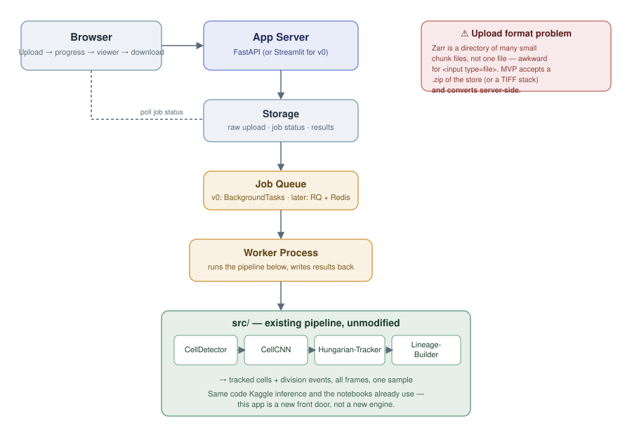

# Phase 2 — MVP Architecture

**Goal:** a biology researcher with no Python/Kaggle knowledge, just microscope videos, gets
through one workflow — Upload Experiment → AI Processing → Interactive Tracking → Download
Report — with no login, no payments, no dashboard.

This document is architecture-first, on purpose: before writing frontend code, decide what
runs where, what "upload" actually means for this data, and how much infrastructure the current
stage of the project (pre-validation) actually justifies.



## Two ways to build this — pick one deliberately

| | **v0: Streamlit, fastest to a real user** | **v1: FastAPI + minimal custom frontend** |
|---|---|---|
| Time to first demo | Days | 1–2+ weeks |
| Interactivity | Basic (frame slider, matplotlib/plotly overlay) | Full (custom canvas/WebGL viewer, smooth scrubbing) |
| Job handling | Synchronous or `st.status` polling a background thread | Real job queue, survives page refresh |
| Multi-user | Works for one demo at a time; not built for concurrent load | Built for concurrent users from the start |
| What it's for | **Getting in front of a lab this week to see if anyone cares** | What you build once v0 gets a "yes, we'd use this" |

**Recommendation: build v0 first, on purpose.** Phase 3 (validation) is more valuable earlier
than more polish is. A researcher can react to a rough Streamlit app with a frame slider just
as well as a slick one — what you're testing is "does this solve a real problem for you," not
"is the UI good." Don't spend v1-grade engineering effort on a question v0 can already answer.
The rest of this document covers both, but the [skeleton](../mvp/streamlit_app.py) shipped
alongside it is v0.

## Component breakdown

### 1. Upload Experiment

**The real problem here isn't the upload widget, it's the file format.** This pipeline's input
is a Zarr store — a *directory* of many small chunk files, not a single file — which doesn't
map onto a plain `<input type="file">` at all. Three options, in order of how much work they are:

1. **Accept a `.zip` of the Zarr store**, unzip server-side. Simplest, but the researcher has
   to know to zip it, and re-zipping a Zarr store isn't necessarily how their acquisition
   software exports it.
2. **Accept a TIFF stack** (the far more common thing microscopy software actually exports) and
   convert to the in-memory array `src/detector.py` expects, server-side, at upload time.
   Probably the better bet for actually matching what labs have — **this is exactly the kind of
   thing to confirm in a Phase 3 interview**, not guess at here.
3. **Direct Zarr/OME-Zarr upload via a resumable/chunked protocol.** More correct long-term,
   real engineering effort, not a v0 concern.

v0 skeleton implements (1) and (2) — zip-of-zarr or TIFF stack, whichever the user has.

### 2. AI Processing

This is the one component that's already built. The worker calls straight into `src/` — the
same `CellDetector`, `CellCNN` (`src/model.py` + `src/predict.py`), `HungarianTracker`, and now
`LineageBuilder` (`src/lineage.py`) used by the notebooks and the Kaggle submission. **This app
is a new front door onto the existing engine, not a new engine** — if `src/` gets better later
(more training data, division detection wired further in, etc.), this app improves for free.

Processing a full video is not instant. v0: run it in a background thread/`BackgroundTasks` and
poll a status file. v1: a real queue (RQ + Redis is the natural next step — it's simple and
Python-native, no need for Celery/RabbitMQ at this stage) so a page refresh doesn't lose the job.

### 3. Interactive Tracking

Minimum viable version: a frame slider, the current frame's max-projection, detected cells as
dots, track lines connecting a cell to itself in the next frame, division points marked
distinctly (now that `LineageBuilder` reports these). That's it — not a full 3D viewer, not
lineage-tree UI, not per-cell metadata panels. Those are all reasonable v1+ additions once
Phase 3 tells you which of them a researcher actually reaches for.

### 4. Download Report

Two things, not fifty: the tracking result as CSV (`LineageBuilder.to_dataframe()` /
`to_ctc_tracks()` — already implemented, already tested), and a couple of summary plots (cells
detected per frame, a division count) as a single PDF or PNG bundle. Resist the urge to build a
whole report-templating system before anyone has said they want one.

## Data flow

1. Researcher uploads a `.zip` or TIFF stack → saved to `storage/{job_id}/raw/`
2. Job enters the queue, status = `queued`
3. Worker picks it up: convert input → volume array → `CellDetector.detect_volume()` →
   `classify_centers()` per frame (CNN filter) → `LineageBuilder.build()` → write
   `storage/{job_id}/results/tracks.csv` + summary plots, status = `done`
4. Browser polls status; once `done`, fetches the interactive viewer data and enables download

## Storage layout (v0: local disk, no database)

```
storage/
    {job_id}/
        raw/              # uploaded zip or TIFF stack
        status.json       # {"state": "queued"|"processing"|"done"|"error", "message": ...}
        results/
            tracks.csv     # LineageBuilder.to_dataframe()
            ctc_tracks.csv # LineageBuilder.to_ctc_tracks()
            frames/        # per-frame preview PNGs for the viewer
            summary.pdf
```

A job ID is a random UUID handed to the browser after upload — that's the entire "auth" model
for v0. No accounts, no login, matches the explicit MVP scope. This is fine for a demo you're
personally walking a researcher through; it is not fine for an unattended public deployment
(anyone with a job ID's URL can see those results) — worth remembering before this goes further
than a hallway demo.

## Explicitly out of scope for v0

- Login / accounts / multi-tenancy
- Payments
- A dashboard, job history, saved projects
- Cell division/lineage UI beyond "mark it on the viewer" (no lineage-tree visualization yet)
- Any of the future modules from the Phase 4 platform framing (segmentation, colony analysis,
  etc.) — not because they're bad ideas, but because none of them belong in front of Phase 3
  evidence.

## Open questions for Phase 3, not decided here

- Do labs' acquisition software actually export TIFF stacks, Zarr, or something else entirely?
  (Changes the whole "Upload" component.)
- Is a CSV + PDF report actually useful to a wet-lab researcher, or do they need something that
  plugs into a tool they already use (napari, ImageJ, FIJI)?
- Is "one video at a time" a real workflow, or do labs process batches?

Answering these with five interviews is cheaper than guessing wrong and rebuilding the upload
or report component after the fact.
